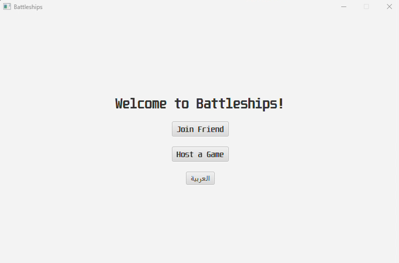
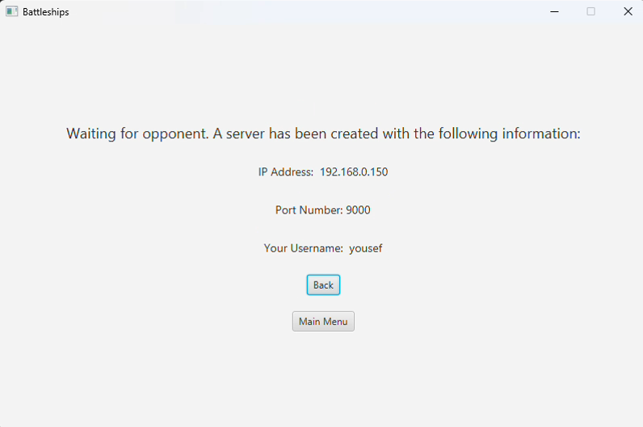

# Battle Ships using JavaFX
#### A JavaFX implementation of the famous battle ships game. It allows two players to play against each other (One players hosts and one player joins)

### Starting the app
#### Players may host a game by starting a server, connect to a player, or change the language (Arabic or English)

### Hosting a game
#### The player that hosts the server must enter a port number

