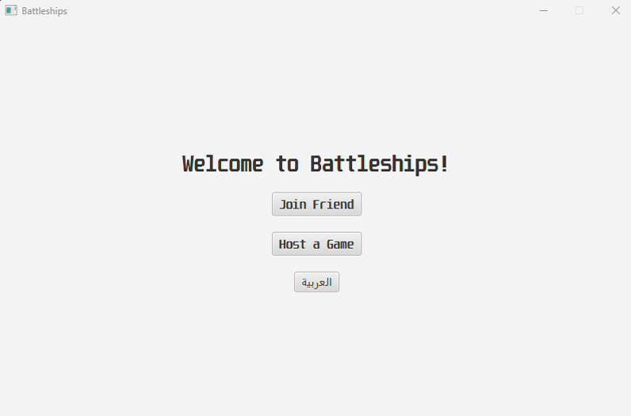
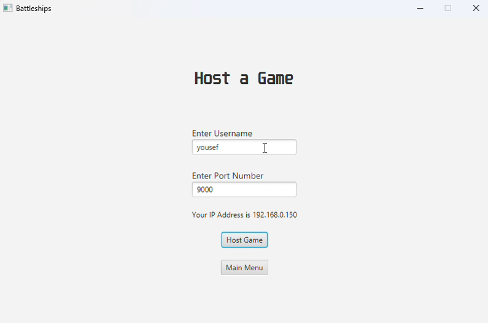
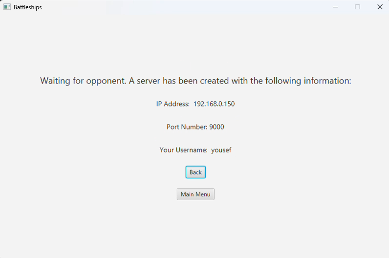
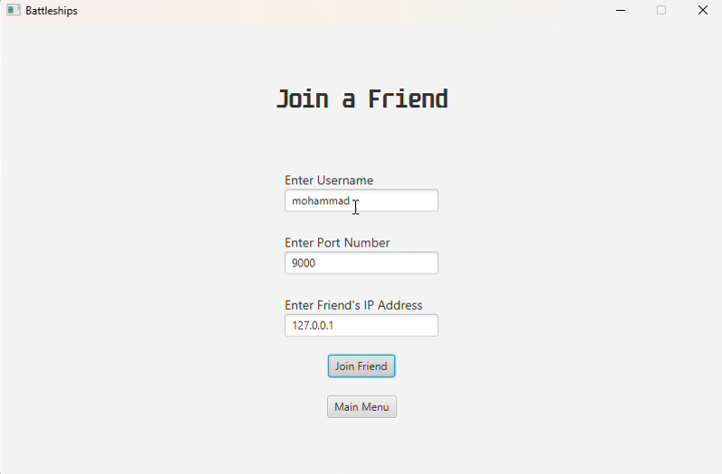
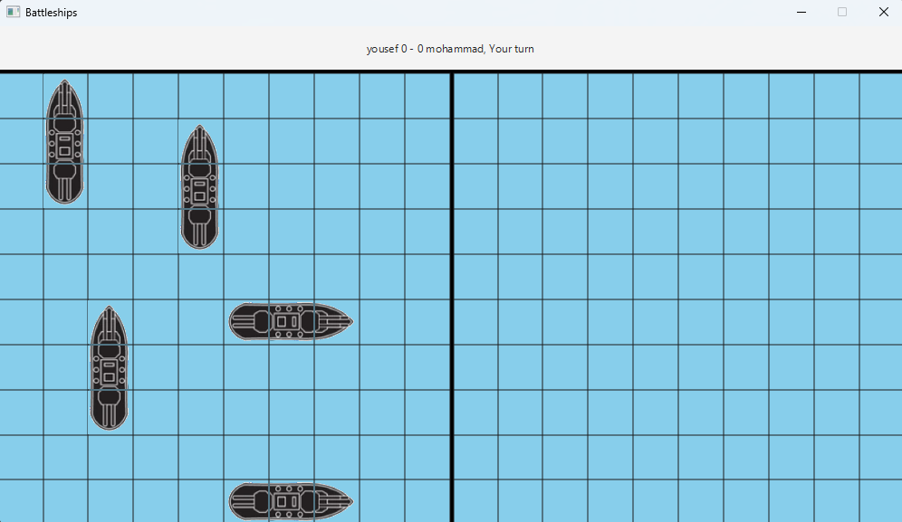
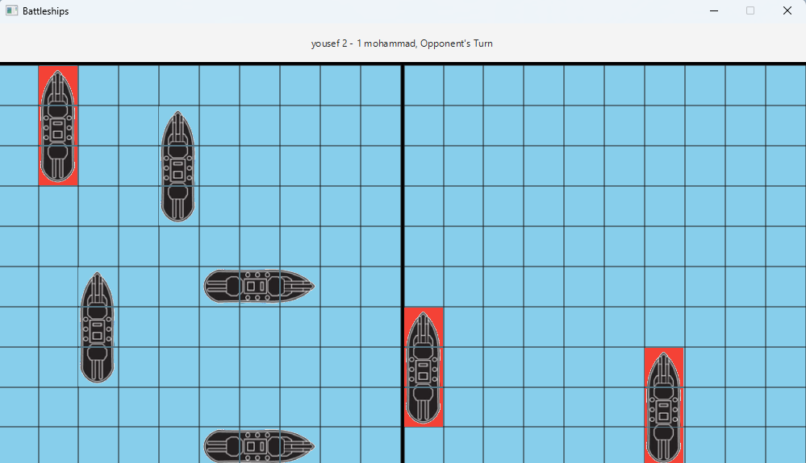

<div align="center">

# ⚓ Battle Ships

**A two-player, network-enabled Battleship game built with JavaFX — one player hosts, the other joins.**

[](https://openjdk.org/)
[](https://openjfx.io/)
[]()
[]()

</div>

---

## 📖 Overview

Battle Ships is a desktop implementation of the classic naval strategy game. Two players connect over a
local network or the internet: one starts a server and shares their port, the other joins with an IP and
port. Ships are placed, shots are fired turn by turn, and the first player to sink the opposing fleet wins.

The interface is fully bilingual — the entire UI can be switched between **Arabic** and **English** from
the welcome screen.

---

## ✨ Features

- 🎮 **Two-player multiplayer** over TCP sockets — host a game or join a friend
- 🌍 **Bilingual UI** — Arabic and English, switchable at launch
- 🖱️ **Interactive board** — place your fleet and fire shots directly on the grid
- 🔄 **Turn-based sync** — moves and results are relayed between both clients in real time
- 🏆 **Win detection** — the match ends automatically once a fleet is fully sunk
- 🖥️ **Pure JavaFX** — no external game engine, everything rendered with JavaFX controls

---

## 📸 Screenshots

### Welcome Screen
> Players may host a game, join another player, or change the language.

<div align="center">
  
</div>

### Hosting a Game
> The host enters a username and a port number, then waits for an opponent to connect.

<div align="center">
  
  
</div>

### Joining a Game
> The joining player enters a username, the host's IP address, and the port number.

<div align="center">
  
</div>

### Gameplay
> Players alternate turns until one fleet is completely sunk.

<div align="center">
  
  
</div>

<!--
PLACEHOLDERS — drop new screenshots into src/images/github_images/ and uncomment:

### Ship Placement
<div align="center">
  
</div>

### Victory Screen
<div align="center">
  
</div>

### Arabic Interface
<div align="center">
  
</div>
-->

---

## 🚀 Getting Started

### Prerequisites

- **JDK 17** or newer
- The **JavaFX SDK** — a copy (`javafx-sdk-17.0.13`) is bundled in this repository, so no separate
  download is required

### Clone

```bash
git clone https://github.com/ba5shy/Battle-Ships.git
cd Battle-Ships
```

### Compile

```bash
javac --module-path javafx-sdk-17.0.13/lib \
      --add-modules javafx.controls,javafx.fxml \
      -d bin $(find src -name "*.java")
```

### Run

```bash
java --module-path javafx-sdk-17.0.13/lib \
     --add-modules javafx.controls,javafx.fxml \
     -cp bin Main
```

> **Note:** replace `Main` with the fully-qualified name of the application's entry class if it lives
> inside a package. On Windows, swap `/` for `\` in the module path and use `;` as the classpath separator.

### Running in VS Code

The repository includes a `vscode` folder with launch configuration — open the project in VS Code with the
*Extension Pack for Java* installed and run directly from the editor.

---

## 🎯 How to Play

1. **Both players** launch the application.
2. **Player 1** selects *Host*, enters a username and a port (e.g. `5000`), and waits.
3. **Player 2** selects *Join*, enters a username, the host's IP address, and the same port.
4. Each player places their fleet on the grid.
5. Players take turns firing at coordinates on the opponent's board — hits and misses are marked.
6. The first player to sink every enemy ship wins.

> Playing over the internet rather than a LAN requires the host to forward the chosen port on their router.

---

## 🗂️ Project Structure

```
Battle-Ships/
├── src/                     # Java source files, FXML views and assets
│   └── images/              # Game sprites and README screenshots
├── bin/                     # Compiled .class output
├── javafx-sdk-17.0.13/      # Bundled JavaFX SDK
├── vscode/                  # Editor launch configuration
└── README.md
```

---

## 🛠️ Built With

| Layer        | Technology              |
| ------------ | ----------------------- |
| Language     | Java 17                 |
| UI           | JavaFX 17.0.13 (+ FXML) |
| Networking   | Java TCP sockets        |
| Localization | Arabic / English         |

---

## 👤 Author

**Yousef Bakhsh** — [@ba5shy](https://github.com/ba5shy)

---

<div align="center">
  <sub>Built with JavaFX ⚓</sub>
</div>
